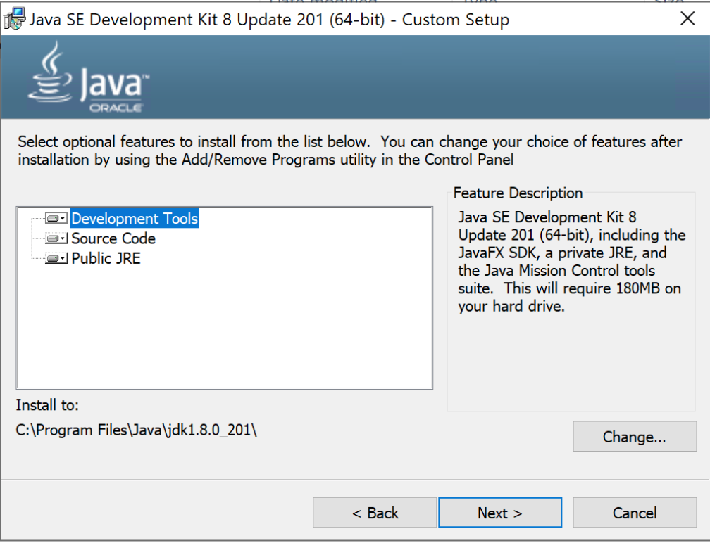
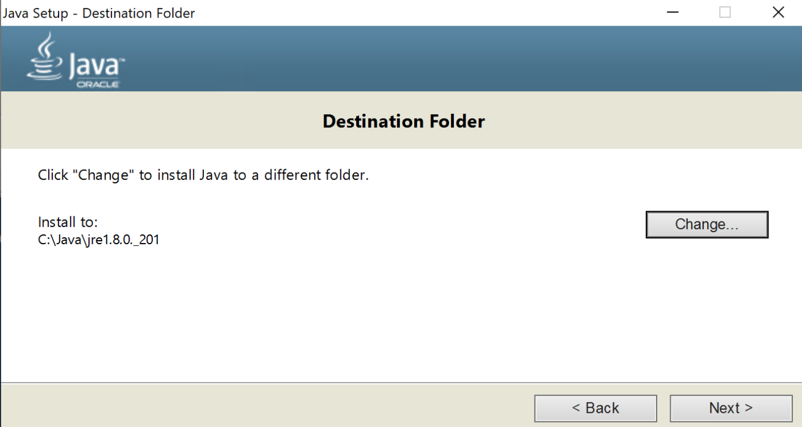
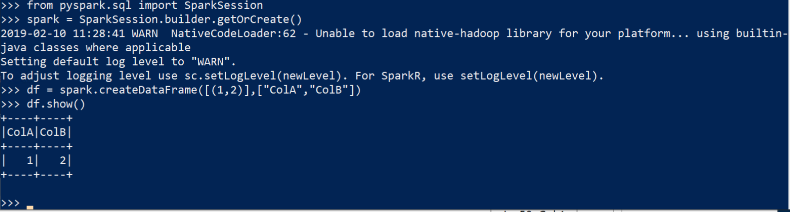

# Setup PySpark on Windows 10

Last Edited: Feb 10, 2019 11:59 AM

# JAVA 8

Download Java 8 (MUST BE JAVA 8) from [https://www.oracle.com/technetwork/java/javase/downloads/jdk8-downloads-2133151.html](https://www.oracle.com/technetwork/java/javase/downloads/jdk8-downloads-2133151.html)
This will install the JDK and JRE
Run the Installer changing the paths to `C:\Java`

# PYTHON

Download Python 3.X (keep in Downloads folder - do not run manually). Execute the following script in a PowerShell ISE window - running as Administrator.

    $DownloadFolder = "~\Downloads"
    $PythonExe = (Get-ChildItem -Path "$DownloadFolder" -Filter "Python-3.*.exe" | select -last 1).FullName
    $args = "/quiet", "InstallAllUsers=0", "PrependPath=1", "Include_test=1", "Include_pip=1"
    &$PythonExe $args
    
    New-Item -Path "C:\Hadoop\Bin" -ItemType Directory -Force
    Invoke-WebRequest -Uri https://github.com/steveloughran/winutils/raw/master/hadoop-2.7.1/bin/winutils.exe -OutFile "C:\Hadoop\Bin\winutils.exe"
    
    $JavaHome = ((Get-ChildItem -Path "C:\Java\jdk*" | select -last 1).FullName)
    [Environment]::SetEnvironmentVariable("JAVA_HOME", $JavaHome, "Machine")
    [Environment]::SetEnvironmentVariable("HADOOP_HOME", "C:\Hadoop", "Machine")

Count to 100 before moving on.

# PySpark

You must use a new PowerShell window to pickup the new Environment Variables.

Open a PowerShell windows (no need for Admin rights). 

This part is very important - currently the latest version of PySpark in Pypi (pip) is 2.4 - there is a bug and it will not work on recent Windows builds. Run version 2.3.2 instead.

Execute:

    &pip install pyspark==2.3.2

You should now be able to type "python" and a Python Terminal opens.

Paste in the following commands:

    from pyspark.sql import SparkSession
    spark = SparkSession.builder.getOrCreate()
    df = spark.createDataFrame([(1,2)],["ColA","ColB"])
    df.show()

You should see:

# Troubleshooting

## JAVA

If you have previously installed Java to the default location you can try:

    $JavaHome = (Get-ChildItem -Path "C:\Program Files\Java\jdk*" | select -last 1).FullName 
    $fso = New-Object -ComObject Scripting.FileSystemObject
    $JavaHome = $fso.GetFolder($JavaHome).ShortPath 
    [Environment]::SetEnvironmentVariable("JAVA_HOME", $JavaHome, "Machine")

Again - make sure you start a new PowerShell session after running the above command

## Python

If you installed Python for "All Users" it will appear in C:\Program Files rather than your profile - that may cause problems. 

At the end of the day you must have the folder that contains the Python.exe file in you environment variable called Path - and it must not contain any spaces (you can use short names to get around spaces).

To view Path at a PowerShell prompt:

    $env:path

To add a Short Path:

    $fso = New-Object -ComObject Scripting.FileSystemObject
    $PythonPath = $fso.GetFolder("C:\Program Files (x86)\Python37-32").ShortPath
    Environment]::SetEnvironmentVariable("Path", $env:Path + ";$PythonPath", "Machine")
